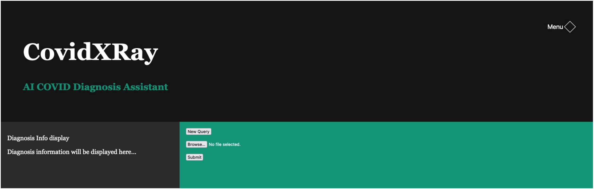
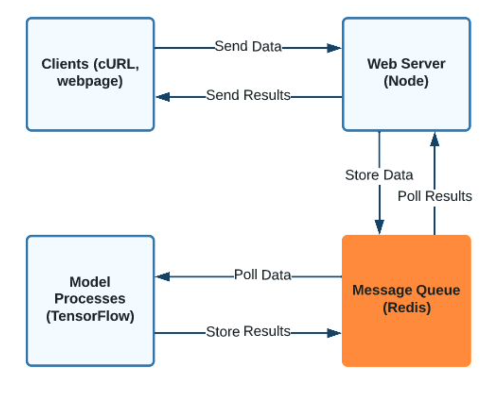

# Chest X-Ray Diagnosis Webapp
## Summary



This project aims to apply a Machine-Learning (ML) model to detect COVID-19 within patient chest X-ray images. Users will be able to upload, store, and choose which images get analyzed using our trained model. The prototype web interface is designed to be a simple tool that provides diagnostic information. The layout will have a few elements, including an image upload area and a diagnosis display section. Our ML model will specifically detect Covid-19 and currently achieve 65% accuracy on public Covid datasets.

To achieve efficiency, we designed a message broker structure to give scalability to the inference process. The implementation of the message broker is done through a Redis queue, and the entire system design can be found below:



# Main Dependencies
Node.js
Express
Tensorflow js
Chest x-ray prediction model saved at "./resources/static/<Model-Name>"

# To Run:
1. start redis
```
redis-server
```
2. start backend server
```
npm run devstart
```
3. Visit "http://localhost:3000/" for home page
